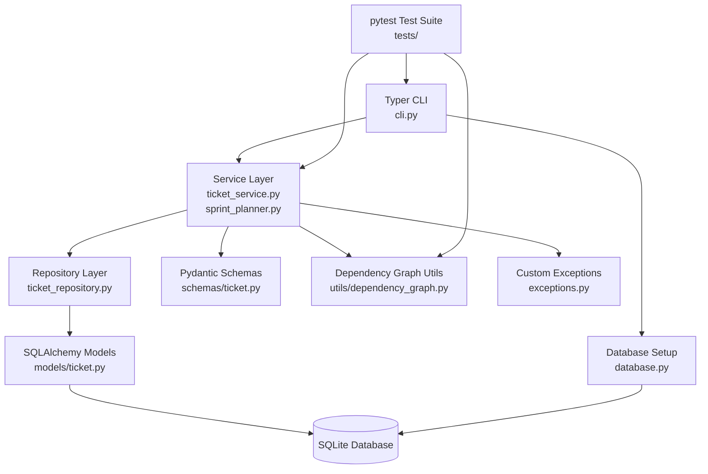
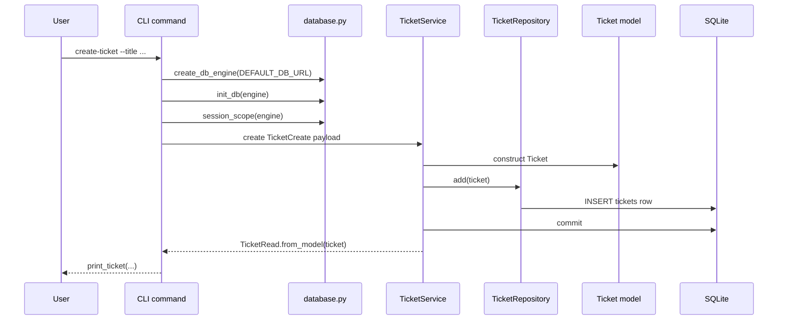

# Ticket Tracker

A Python based CLI application MVP for tracking tickets, managing ticket dependencies, detecting blocked work and creating sprint plans.

[](https://github.com/MichaelAndri/advanced-programming-assignment/actions/workflows/ci.yml)
[](https://codecov.io/github/michaelandri/advanced-programming-assignment)

## Stack 

- Python 3.12+
- [Typer](https://github.com/fastapi/typer)
- SQLite
- [SQLAlchemy](https://www.sqlalchemy.org)
- [Pydantic](https://pydantic.dev/docs/validation/latest/concepts/models/)
- [pytest](https://docs.pytest.org/en/stable/)

## Architecture Diagrams







## Setup

```bash
python3.12 -m venv .venv
source .venv/bin/activate
pip install -e ".[dev]"
```

The CLI uses SQLite by default and creates `ticket_tracker.db` in the current working directory. To use a custom path:

```bash
export TICKET_TRACKER_DB_URL="sqlite:///my_tracker.db"
```

## CLI Usage

### Create a ticket

```bash
ticket-tracker create-ticket \
  --title "My first ticket" \
  --description "My first feature" \
  --priority 3 \
  --estimate-points 5 \
  --assignee "Bob" \
  --tags "planning,mvp"
```

- Ticket priority - uses integers: `1 = low`, `2 = medium`, `3 = high`
- Estimate points (story points) - can be any positive integer


### List tickets

```bash
ticket-tracker list-tickets
```

### Update a ticket

```bash
ticket-tracker update-ticket TICKET_ID --status in_progress --estimate-points 8
```
- Ticket status values are `todo`, `in_progress`, and `done`

### Delete a ticket

```bash
ticket-tracker delete-ticket TICKET_ID
```

### Add a dependency

```bash
ticket-tracker add-dependency TICKET_ID DEPENDENCY_ID
```
- Dependencies are modeled as a self-referential many-to-many relationship


### List blocked tickets

```bash
ticket-tracker list-blocked
```

### Detect dependency cycles

```bash
ticket-tracker detect-cycles
```

### Plan a sprint

```bash
ticket-tracker plan-sprint 10
```
- prioritises the highest priority tickets first
- schedules unfinished dependencies before the dependent ticket
- skips tickets that do not fit within the remaining capacity of the sprint
- refuses to plan if dependency cycles exist

## Development

To run the test suite:

```bash
pytest
```

To run the test suite with coverage stats:
```bash
pytest --cov
```

To run the linter:

```bash
ruff format .
```